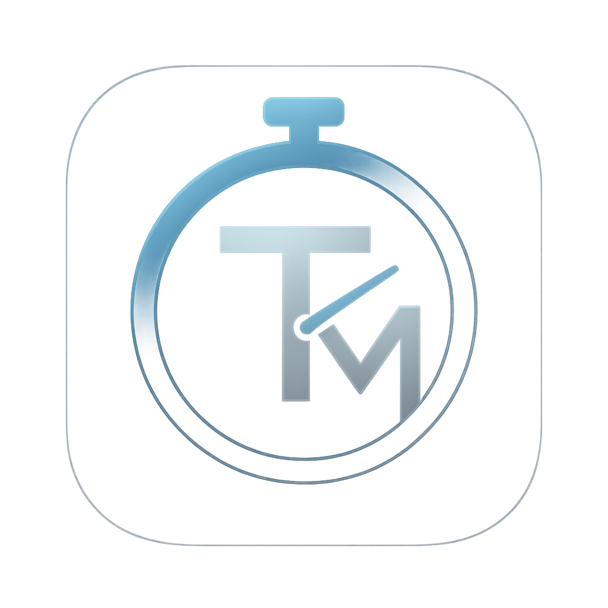
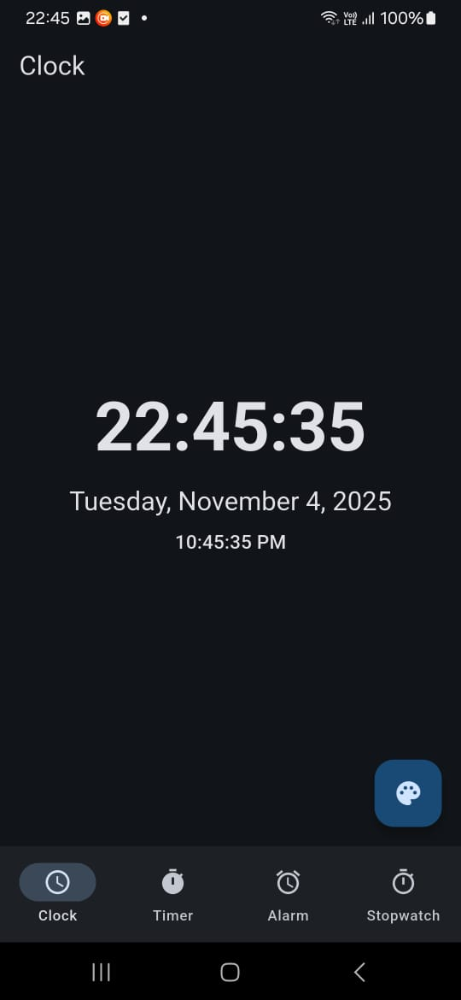
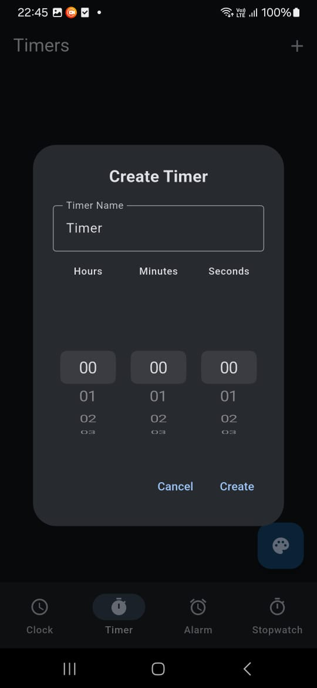

# Timer App

<div align="center">
  
</div>

A comprehensive Flutter application for managing clocks, countdown timers, alarms, and stopwatches. Built with the MVC (Model-View-Controller) architecture pattern.

## Screenshots

<div align="center">
  
  
</div>

## Features

### ⏰ Countdown Timer
- Create multiple countdown timers that can run simultaneously
- Timers continue running in the background even when the app is closed or device is locked
- Real-time notifications with sound and vibration when timers finish
- Start, pause, reset, and cancel functionality for each timer
- Beautiful Cupertino-style time picker for easy timer creation

### 🔔 Alarm Functionality
- Set multiple alarms with custom names
- Repeat alarms on specific days of the week
- Alarms trigger notifications and sound even when the app is closed
- Toggle alarms on/off easily
- One-time or recurring alarm options

### ⏱️ Stopwatch
- Start, pause, lap, and reset functionalities
- Support for multiple stopwatches
- Track lap times with detailed history
- High-precision timing (millisecond accuracy)

### 🕐 Clock
- Real-time digital clock display
- Shows current date and time in multiple formats
- 12-hour and 24-hour format support

### 🎨 User Interface
- Clean, modern Material Design 3 UI
- Dark/Light/System theme support
- Bottom navigation for easy access to all features
- Responsive design for Android and iOS

### 💾 Data Persistence
- All timers, alarms, and stopwatches are saved automatically
- State persists across app restarts
- Background tasks continue to work after app restart

## Architecture

This app follows the **MVC (Model-View-Controller)** pattern:

### Models (`lib/models/`)
- `timer_model.dart` - Countdown timer data structure
- `alarm_model.dart` - Alarm data structure with repeat functionality
- `stopwatch_model.dart` - Stopwatch and lap data structures

### Controllers (`lib/controllers/`)
- `timer_controller.dart` - Manages timer logic and state
- `alarm_controller.dart` - Handles alarm scheduling and notifications
- `stopwatch_controller.dart` - Manages stopwatch operations

### Views (`lib/views/`)
- `clock_view.dart` - Clock display screen
- `timer_view.dart` - Timer creation and management UI
- `alarm_view.dart` - Alarm creation and management UI
- `stopwatch_view.dart` - Stopwatch interface
- `main_screen.dart` - Main navigation screen

### Services (`lib/services/`)
- `notification_service.dart` - Local notifications for timers and alarms
- `storage_service.dart` - Persistent storage using SharedPreferences
- `background_service.dart` - Background task management using scheduled notifications

## Getting Started

### Prerequisites
- Flutter SDK (3.9.0 or higher)
- Dart SDK
- Android Studio / Xcode for mobile development
- Android device/emulator or iOS device/simulator

### Installation

1. Clone the repository:
```bash
git clone <repository-url>
cd timer_app
```

2. Install dependencies:
```bash
flutter pub get
```

3. For Android, ensure you have the required permissions in `AndroidManifest.xml` (already configured):
   - Notification permissions
   - Exact alarm permissions
   - Background task permissions

4. For iOS, ensure background modes are enabled in `Info.plist` (already configured)

5. Run the app:
```bash
flutter run
```

## Usage

### Creating a Timer
1. Navigate to the Timer tab
2. Tap the `+` button
3. Enter a timer name
4. Use the time picker to set hours, minutes, and seconds
5. Tap "Create" to start the timer

### Setting an Alarm
1. Navigate to the Alarm tab
2. Tap the `+` button
3. Enter an alarm name
4. Select the time using the time picker
5. Optionally select repeat days
6. Tap "Create" to save the alarm

### Using the Stopwatch
1. Navigate to the Stopwatch tab
2. Tap the `+` button to create a new stopwatch
3. Tap "Start" to begin timing
4. Tap "Lap" to record lap times while running
5. Tap "Pause" to pause, or "Reset" to clear

### Changing Theme
1. Tap the palette icon (floating action button)
2. Select Light, Dark, or System theme
3. The theme preference is saved automatically

## Dependencies

- `provider` - State management
- `flutter_local_notifications` - Local notifications
- `shared_preferences` - Data persistence
- `intl` - Internationalization and date formatting
- `audioplayers` - Audio playback for alarms
- `uuid` - Unique ID generation
- `timezone` - Timezone support for scheduled notifications

## Technical Details

### Background Functionality
- Uses scheduled notifications for reliable background operation
- Timers and alarms continue working even when the app is closed
- Notifications are scheduled at timer/alarm start time
- Foreground timer updates UI when app is open

### Notification System
- High-priority notifications for timer completion
- Scheduled notifications for alarms
- Sound and vibration support
- Lock screen notifications enabled

### Data Storage
- All data stored locally using SharedPreferences
- JSON serialization for complex data structures
- Automatic save on state changes

## Platform Support

- ✅ Android
- ✅ iOS


## Building for Release

### Android
```bash
flutter build apk --release
# or
flutter build appbundle --release
```

### iOS
```bash
flutter build ios --release
```


## Contributing

Contributions are welcome! Please feel free to submit a Pull Request.

## License

This project is open source and available under the MIT License.


## Acknowledgments

- Flutter team for the amazing framework
- All package maintainers whose dependencies made this app possible
